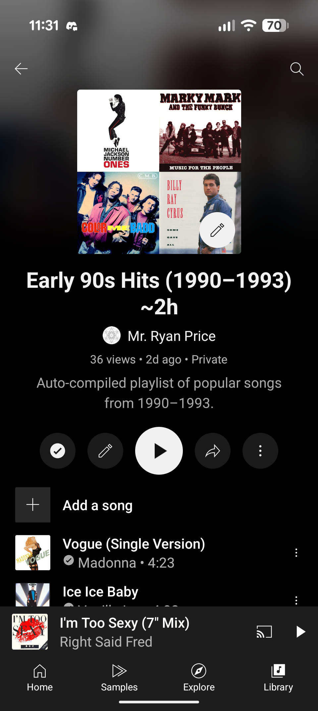

# YouTube Early 90s Playlist Generator



An automated Node.js application that creates a curated YouTube playlist of popular songs from 1990-1993. The application uses the YouTube Data API v3 to search for music videos and automatically builds a ~2-hour playlist targeting the early 90s era.

## What This Application Does

This tool automatically:
- Creates a private YouTube playlist titled "Early 90s Hits (1990–1993) ~2h"
- Searches for official music videos of pre-defined popular songs from 1990-1993
- Intelligently selects the best video matches based on duration and relevance
- Adds videos to the playlist until it reaches approximately 2 hours in length
- Handles OAuth authentication with Google/YouTube APIs

The application comes with a curated seed list of 29 iconic early 90s hits including:
- Madonna - Vogue
- Nirvana - Smells Like Teen Spirit
- Whitney Houston - I Will Always Love You
- MC Hammer - U Can't Touch This
- R.E.M. - Losing My Religion
- And many more classic tracks from 1990-1993

## Features

- **Smart Video Selection**: Uses multiple search strategies to find the best official videos
- **Duration Optimization**: Prioritizes videos between 2-8 minutes and builds playlist to target 2 hours
- **OAuth Flow**: Secure authentication with automatic browser opening and local callback handling
- **Cross-Platform**: Works on macOS, Windows, and Linux
- **Configurable**: Easy to modify song list, target duration, and regional preferences
- **Error Handling**: Graceful handling of missing videos or API errors

## Prerequisites

Before you begin, ensure you have:

1. **Node.js** (version 14 or higher)
2. **npm** (comes with Node.js)
3. **Google Cloud Project** with YouTube Data API v3 enabled
4. **OAuth 2.0 credentials** for a desktop application

## Google Cloud Setup

### 1. Create a Google Cloud Project

1. Go to the [Google Cloud Console](https://console.cloud.google.com/)
2. Create a new project or select an existing one
3. Note your project ID

### 2. Enable YouTube Data API v3

1. In the Google Cloud Console, navigate to "APIs & Services" > "Library"
2. Search for "YouTube Data API v3"
3. Click on it and press "Enable"

### 3. Create OAuth 2.0 Credentials

1. Go to "APIs & Services" > "Credentials"
2. Click "Create Credentials" > "OAuth 2.0 Client IDs"
3. If prompted, configure the OAuth consent screen:
   - Choose "External" user type
   - Fill in the required application information
   - Add your email to test users
4. For Application type, select "Desktop application"
5. Give it a name (e.g., "YouTube Playlist Generator")
6. Click "Create"
7. Download the credentials JSON file or copy the Client ID and Client Secret

## Installation & Setup

### 1. Clone or Download the Project

```bash
git clone <repository-url>
cd yt-playlist
```

Or download and extract the project files to a folder.

### 2. Install Dependencies

```bash
npm install
```

This will install the required packages:
- `googleapis` - Google APIs client library
- `dotenv` - Environment variable loader
- `open` - Cross-platform browser opener

### 3. Environment Configuration

Create a `.env` file in the project root with your Google OAuth credentials:

```bash
# Copy from your Google Cloud OAuth 2.0 credentials
GOOGLE_CLIENT_ID=your_client_id_here
GOOGLE_CLIENT_SECRET=your_client_secret_here

# OAuth redirect URI (keep as-is for local development)
GOOGLE_REDIRECT_URI=http://127.0.0.1:5173/oauth2callback
```

**Important**: Replace `your_client_id_here` and `your_client_secret_here` with the actual values from your Google Cloud Console OAuth credentials.

### 4. Verify Setup

Your project structure should look like:

```
yt-playlist/
├── index.cjs           # Main application file
├── package.json        # Project configuration
├── package-lock.json   # Dependency lock file
├── .env               # Environment variables (your credentials)
├── node_modules/      # Installed dependencies
└── token.json         # OAuth token storage (created after first auth)
```

## How to Run

### First Run (Authentication Required)

```bash
node index.cjs
```

On first run, the application will:

1. **Open your browser** automatically to Google's OAuth consent page
2. **Ask for permission** to manage your YouTube account
3. **Redirect back** to a local callback URL after you authorize
4. **Save the authentication token** to `token.json` for future use
5. **Begin creating the playlist** immediately

### Subsequent Runs

```bash
node index.cjs
```

After the first authentication, the app will use the saved token and start creating playlists immediately.

## Sample Output

```
Authorize this app by visiting:
https://accounts.google.com/oauth/authorize?access_type=offline&scope=...

Waiting for OAuth callback at http://127.0.0.1:5173/oauth2callback ...
Saved OAuth tokens to /path/to/token.json

Creating playlist…
Playlist ID: PLxxxxxxxxxxxxxxxxxxxxxx

Searching: Madonna - Vogue
  ✓ Using: dQw4w9WgXcQ (4m) — Madonna - Vogue (Official Video)
Added dQw4w9WgXcQ (4 min). Total: 4 min

Searching: Vanilla Ice - Ice Ice Baby
  ✓ Using: rog8ou-ZepE (4m) — Vanilla Ice - Ice Ice Baby (Official Video)
Added rog8ou-ZepE (4 min). Total: 8 min

...

Done. Total length ≈ 118 minutes.
Open your playlist: https://www.youtube.com/playlist?list=PLxxxxxxxxxxxxxxxxxxxxxx
```

## Configuration Options

You can customize the application by editing these variables in `index.cjs`:

### Playlist Settings
- `PLAYLIST_TITLE`: Name of the generated playlist
- `PLAYLIST_DESCRIPTION`: Description text for the playlist
- `TARGET_MINUTES`: Target playlist length in minutes (default: 120 = 2 hours)
- `MAX_OVERRUN_MIN`: Acceptable overage in minutes (default: 5)

### Regional Settings
- `REGION_CODE`: YouTube region code (default: 'CA' for Canada)
- `RELEVANCE_LANG`: Search language preference (default: 'en')

### Song List
The `SONGS` array contains the seed tracks. Format: `"Artist - Title"`. You can:
- Add new songs to the list
- Remove songs you don't want
- Reorder for different prioritization

### Privacy Settings
In the `createPlaylist` function, change:
```javascript
status: { privacyStatus: 'private' } // Options: 'private', 'public', 'unlisted'
```

## Troubleshooting

### Common Issues

**"Missing GOOGLE_CLIENT_ID / GOOGLE_CLIENT_SECRET in .env"**
- Check that your `.env` file exists and contains valid credentials
- Ensure there are no spaces around the `=` signs in the `.env` file

**OAuth errors during authentication**
- Verify your OAuth redirect URI matches exactly: `http://127.0.0.1:5173/oauth2callback`
- Check that your Google Cloud project has YouTube Data API v3 enabled
- Ensure your OAuth consent screen is properly configured

**"Search error" or "Add error" messages**
- These are typically temporary API rate limiting or connectivity issues
- The app will continue with other songs; failed songs are logged but don't stop execution

**Browser doesn't open automatically**
- Copy the authorization URL from the console and paste it into your browser manually
- Complete the OAuth flow and the app will continue

**Videos not found for certain songs**
- This is normal; some songs may not have official videos on YouTube or may be region-restricted
- The app logs which songs couldn't be found and continues with available tracks

### API Quotas

The YouTube Data API v3 has daily quotas:
- Default quota: 10,000 units per day
- This application uses approximately 150-200 units per run
- Search operations: ~1-3 units per song
- Video details: ~1 unit per batch of videos
- Playlist creation: ~50 units
- Adding items: ~50 units

You can run this application multiple times per day without hitting quota limits.

### Token Expiration

OAuth tokens are automatically refreshed when possible. If you encounter authentication errors:

1. Delete the `token.json` file
2. Run the application again to re-authenticate

## Technical Details

### Dependencies

- **googleapis**: Official Google APIs client library for Node.js
- **dotenv**: Loads environment variables from `.env` file
- **open**: Cross-platform utility to open URLs in the default browser

### Architecture

The application follows a straightforward workflow:

1. **Authentication**: OAuth 2.0 flow with local HTTP server for callback handling
2. **Search Strategy**: Multiple query variations per song to improve hit rate
3. **Video Selection**: Ranking algorithm considering duration, relevance, and search position
4. **Playlist Building**: Iterative addition until target duration is reached
5. **Error Handling**: Graceful degradation when individual songs fail

### File Structure

- `index.cjs`: Main application (CommonJS format for compatibility)
- `.env`: Environment variables (credentials)
- `token.json`: OAuth token storage (auto-generated)
- `package.json`: Node.js project configuration

## Security Notes

- Your `.env` file contains sensitive credentials - never commit it to version control
- The generated `token.json` file contains access tokens - treat it as sensitive
- Playlists are created as private by default - change privacy settings as needed
- OAuth flow uses a local HTTP server - ensure port 5173 is available

## License

This project is licensed under the ISC License.

## Contributing

Feel free to fork this project and customize it for your needs. Common modifications:
- Different time periods (80s, 2000s, etc.)
- Genre-specific playlists (rock, pop, hip-hop)
- Regional music preferences
- Different playlist lengths or formats

---

Enjoy your automatically generated early 90s playlist! 🎵
